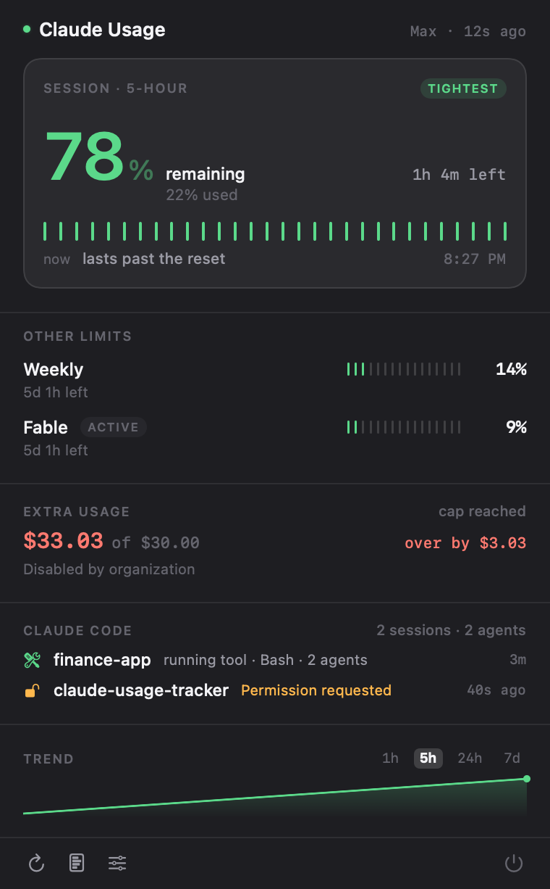
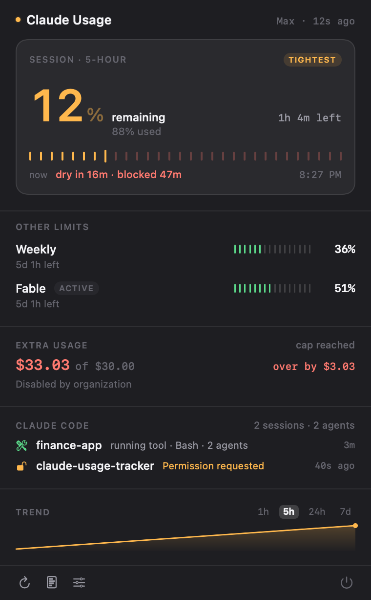
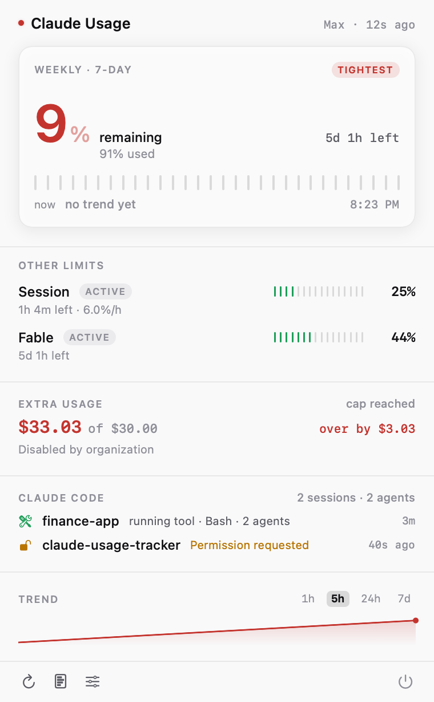

# Claude Usage Tracker v2

Know how much Claude quota you have left, how fast you are burning it, whether you will run
out before the reset — and what Claude Code is doing right now — without leaving the menu bar.

Three clients, one data model:

| | |
|---|---|
| **Native macOS menu bar app** | SwiftUI `MenuBarExtra`, notifications, local history, Claude Code activity. The main event. |
| **Web dashboard** | React + Vite. Gauges, charts, CSV export. Runs anywhere. |
| **SwiftBar plugin** | Bash + `python3`. Zero build, zero dependencies. Kept as a fallback. |

| Plenty left | Running out | Weekly is the constraint |
|---|---|---|
|  |  |  |

These are generated, not hand-captured — `ClaudeUsage --render-preview <dir>` renders every
scenario in both appearances from fixture data, so they never drift from the real UI:

```bash
cd macos && "$(swift build --product ClaudeUsageApp --show-bin-path)/ClaudeUsageApp" \
  --render-preview ../docs/screenshots
```

### The runway

The panel is built around one question: **will I run out before the reset?**

Every tracker shows *67% used*, *resets in 1h 4m*, and *burning 44%/h* as three separate facts
and leaves you to do the arithmetic. The runway strip does it for you — the track is the time
until the reset, the fill is how far your current burn rate actually carries you, and the
hatched tail is the stretch you'll spend blocked.

```
▓▓▓▓▓▓▓▓▓▓▓╳▨▨▨▨▨▨▨▨▨▨▨▨▨▨▨▨▨   Dry in 16m · blocked 47m      4:09 PM
```

With too little history it draws a dashed, inert track and says so, rather than inventing a
line.

---

## Features

**Usage**
- 5-hour session and 7-day windows, with time-to-reset and the exact reset clock time.
- **Model-specific limits** — read from the API's `limits[]` array, which is where Anthropic
  actually exposes them. The section is hidden entirely when your account has none.
- **Extra usage / spend** in real money, respecting the currency exponent the API sends.
- The menu bar shows the limit **closest to its ceiling**, not just the session — so
  `5h = 25%, 7d = 91%` reads as *91%*, tagged `W`, instead of a comfortable-looking 25%.

**Analytics**
- Burn rate (%/hour), average per day, projected utilisation at reset, estimated time to 100%.
- Reset-boundary aware: a quota reset restarts the window instead of poisoning the average.
- Says **"Not enough data yet"** rather than inventing a trend from two samples.

**Claude Code activity**
- Which project is active, what it is doing, how long the turn has run, how many subagents.
- Whether it **needs you** — permission prompt, waiting for input, error, rate limit.
- Multiple concurrent sessions, each listed separately.

**Notifications**
- Threshold alerts at 50 / 75 / 90 / 95 / 100 %, configurable, once per quota window.
- Projected-overrun, sudden-acceleration, quota-reset, auth-expired, rate-limited.
- Claude Code: needs permission, waiting, long task finished, error.
- Per-category cooldowns, per-session cooldowns, and quiet hours.

**Everything else**
- Local history with 24 h / 7 d / 30 d retention and a sparkline.
- Last-known-good values on error — never a screen of zeros.
- Keychain credentials, no telemetry, no backend.

---

## Installation

### Native macOS app (recommended)

**Xcode is not required.** The app builds with Command Line Tools alone.

```bash
cd macos && ./scripts/build-app.sh --install --run
```

That produces `macos/build/ClaudeUsage.app`, copies it to `/Applications`, ad-hoc signs it,
and launches it. Drop `--install` to build in place, drop `--run` to not launch.

Requirements: macOS 14+, Swift 6 toolchain (`xcode-select --install` is enough).

If you do have Xcode, `open macos/Package.swift` works too.

### Claude Code activity tracking

```bash
cd macos && ./scripts/install-hooks.sh
```

This registers observability hooks in `~/.claude/settings.json` (use `--project` to scope them
to one repo, `--dry-run` to preview). It backs the file up first and leaves every hook that
isn't ours untouched. Re-running is safe.

**Activity appears from your next Claude Code session onward** — sessions already running have
no hooks loaded.

To remove: `./scripts/uninstall-hooks.sh` (add `--purge` to delete the local state too).

### Web dashboard

```bash
npm install && npm run dev
```

Then open http://localhost:5173. Deployed builds work through the `vercel.json` rewrite.

### SwiftBar plugin

Copy or symlink `swiftbar/claude-usage.2m.sh` into your SwiftBar plugins folder and make it
executable. It refreshes every two minutes.

> If you already have it symlinked, note that the link breaks when this repo moves — re-point
> it after moving the folder.

---

## Authentication

The native app looks for a token in this order:

1. **Its own keychain item** — anything you paste into Settings › General.
2. **Claude Code's credentials** — `Claude Code-credentials` in your login keychain. If you are
   signed in to Claude Code, the app just works. macOS asks your permission the first time it
   reads the item; that prompt is the consent point.
3. **`~/.claude-usage-token`** — the plaintext file v1 and the SwiftBar plugin use.

The web dashboard needs a token pasted in (browsers cannot read your keychain). Get one with:

```bash
security find-generic-password -s "Claude Code-credentials" -w | python3 -c "import sys,json; print(json.loads(sys.stdin.read())['claudeAiOauth']['accessToken'])"
```

For local development the Vite proxy will inject `CLAUDE_CODE_OAUTH_TOKEN` server-side so the
token never reaches the browser:

```bash
CLAUDE_CODE_OAUTH_TOKEN="$(security find-generic-password -s 'Claude Code-credentials' -w | python3 -c "import sys,json; print(json.loads(sys.stdin.read())['claudeAiOauth']['accessToken'])")" npm run dev
```

---

## Privacy

Everything is local. There is no server belonging to this project, no analytics endpoint, and
no crash reporter.

**Network:** exactly one destination — `api.anthropic.com`, once per refresh interval.

**Your token** lives in the login keychain. It is never written to a file by this app, never
logged, and never included in the debug report. `URLSession` runs with an ephemeral
configuration and no cache, so responses are not written to disk behind your back.

**Stored locally**, under `~/.claude-usage-tracker/` (mode `700`):

| File | Contents |
|---|---|
| `history.json` | usage percentages + timestamps |
| `last-usage.json` | the most recent parsed snapshot, so a cold launch isn't blank |
| `sessions/*.json` | Claude Code session metadata, one file per session |
| `events.jsonl` | the last 200 hook **event names** and timestamps |
| `activity.json` | a rollup for other consumers (the SwiftBar plugin reads it) |
| `notifications.json` | which alerts have already fired, so they don't repeat |

**The Claude Code hook records:** session id, working directory, project folder name, event
name, tool **name**, permission mode, effort level, agent type, and counters.

**It never records:** your prompts, Claude's replies, tool arguments, or tool output. There is
no setting to enable that — the code to write it does not exist. The hook test suite asserts
this (`macos/scripts/test-hook.sh`).

Delete everything with `rm -rf ~/.claude-usage-tracker` and the keychain item from
Settings › General › Remove stored token.

---

## Architecture

```
claude-usage-tracker/
├── src/                              React dashboard
│   ├── lib/usageModel.js             ← shared normalizer (JS twin of the Swift parser)
│   ├── App.jsx  components/  utils/
├── swiftbar/claude-usage.2m.sh       fallback plugin
├── macos/                            native menu bar app (SwiftPM)
│   ├── Package.swift
│   ├── hooks/claude-activity-hook    observability-only Claude Code hook
│   ├── scripts/
│   │   ├── build-app.sh              → ClaudeUsage.app  (no Xcode needed)
│   │   ├── install-hooks.sh  uninstall-hooks.sh
│   │   └── test-hook.sh              end-to-end hook tests
│   └── ClaudeUsage/
│       ├── Models/       UsageSnapshot, LimitWindow, SpendInfo, ActivityState, JSONValue
│       ├── Services/     API client, TokenStore, HistoryStore, ActivityMonitor, Settings
│       ├── Analytics/    burn rate, projection, surge detection  (pure)
│       ├── Notifications/ policy (pure) + UNUserNotificationCenter delivery
│       ├── App/  Views/  Resources/
│       └── Tests/        87 tests + sanitized fixtures
└── docs/MENUBAR_V2_PLAN.md           design record + full API field inventory
```

**`ClaudeUsageCore`** is a plain library with no SwiftUI import — every decision that could be
wrong (parsing, analytics, notification policy, activity aggregation) lives there and is unit
tested. **`ClaudeUsageApp`** is the SwiftUI executable on top.

Both the Swift and JavaScript parsers produce the same limit ids, so history recorded by one
client is readable by the other.

---

## API limitations — read this

The app reads `https://api.anthropic.com/api/oauth/usage`, the endpoint that powers Claude
Code's own `/usage` display.

> **This is an internal, undocumented Anthropic endpoint.** It is not part of the public
> Anthropic API, it carries no stability guarantee, and it can change or disappear at any
> time. This project is not affiliated with Anthropic.

Everything here is built on the assumption that it *will* change:

- The payload is decoded into a total `JSONValue` tree and then read with optional accessors.
  A removed field becomes `nil`. Nothing throws, nothing crashes.
- `limits[]` is the primary source; the older `five_hour` / `seven_day` / `seven_day_<model>`
  keys are a fallback for accounts that still return them.
- An unrecognized limit `kind` still renders, using its raw name — new limit types show up
  rather than vanishing.
- Money always respects the `exponent` / `decimal_places` the API sends. (v1 divided by
  nothing and displayed `$3303.00` where the truth was `$33.03`.)
- **`resets_at` is only stable to the second.** The same window comes back with different
  fractional seconds on every request — `…20:00:00.196578`, then `…20:00:00.275325`. The parser
  truncates it, and a quota reset is detected from utilisation actually *falling*, never from
  the timestamp moving. Trusting the timestamp produced a "Weekly quota reset — was 39%, now
  39%" notification every couple of minutes.
- Missing fields accumulate human-readable notes visible in Settings › History › Debug.

The response also contains internal codename keys — `tangelo`, `nimbus_quill`,
`iguana_necktie`, `cinder_cove`, `amber_ladder`, `omelette_promotional`. Their meaning is not
documented, so **this app never invents labels for them.** They are preserved in the debug
export and otherwise ignored.

A full field inventory, with types and example values, is in
[docs/MENUBAR_V2_PLAN.md](docs/MENUBAR_V2_PLAN.md#2-api-field-inventory).

### Known limitations

- **Sessions that started before you installed the hooks are invisible.** Hooks load at
  session start.
- **A `SIGKILL`ed Claude Code leaves a session file behind** until the next refresh notices
  the pid is gone. pid reuse could in principle keep a dead record alive; it has not been
  observed.
- **A session that stops reporting** for longer than the staleness window is shown as
  *Unknown*, not as *Working*. We do not guess.
- **Notifications need a signed bundle.** `build-app.sh` ad-hoc signs, which is enough. If
  signing fails, the app falls back to `osascript` notifications and says so in Settings.
- **Model-specific limits depend on your plan.** If the API returns no scoped limits, the
  section is hidden rather than faked.
- **Dollar figures per window** (`limit_dollars`, `used_dollars`) are `null` on subscription
  plans; those rows appear only if your account populates them.

---

## Development

```bash
# Web dashboard
npm install
npm run lint
npm run build

# Swift core + app
cd macos
swift build                    # library + app
swift test                     # 87 tests, swift-testing
./scripts/build-app.sh         # → build/ClaudeUsage.app

# Claude Code hook (46 assertions, runs against a throwaway HOME)
./scripts/test-hook.sh
```

The SwiftBar plugin can be exercised without spending an API call:

```bash
CLAUDE_USAGE_FIXTURE=macos/ClaudeUsage/Tests/Fixtures/usage-current.json bash swiftbar/claude-usage.2m.sh
```

Test fixtures in `macos/ClaudeUsage/Tests/Fixtures/` are **sanitized** — no real identifiers,
no tokens. They cover the current shape, the legacy shape, an empty payload, malformed
entries, and a deliberately unknown future shape.

---

## Troubleshooting

**Menu bar shows `—` or "Not connected"**
Settings › General shows which credential sources were detected. If none, paste a token or
sign in to Claude Code. If macOS asked for keychain access and you clicked Deny, grant it in
Keychain Access for the `Claude Code-credentials` item.

**"Authentication expired"**
The OAuth token was rejected. Re-run `claude` to refresh Claude Code's credentials, or paste a
fresh token in Settings.

**"Rate limited"**
The usage endpoint has its own rate limit, separate from your Claude quota. The app backs off
automatically and keeps showing the last known values. Polling more often than 30 s will hit
this; 2 minutes is the default for a reason.

**No Claude Code activity**
Run `macos/scripts/install-hooks.sh`, then start a **new** Claude Code session. Check that
files appear in `~/.claude-usage-tracker/sessions/`. Verify the hooks landed with
`python3 -c "import json;print(list(json.load(open('$HOME/.claude/settings.json'))['hooks']))"`.

**No notifications**
Settings › Notifications shows the system permission state. If it says *Denied*, enable
ClaudeUsage in System Settings › Notifications. If it says *Unavailable*, the app is running
unbundled — build it with `build-app.sh` rather than `swift run`.

**"Launch at login" is greyed out**
`SMAppService` only works for an installed bundle. Run `build-app.sh --install`.

**"Usage format not recognized"**
Anthropic changed the payload. Turn on Settings › History › Debug to see which fields went
missing, and copy the sanitized debug report (it contains no credentials).

**Dashboard shows an old number**
That is deliberate — on an error the last successful values stay on screen, labelled with
their age, instead of being replaced by zeros.

---

## Uninstall

```bash
# Menu bar app
osascript -e 'tell application "ClaudeUsage" to quit'
rm -rf /Applications/ClaudeUsage.app

# Claude Code hooks + all local state
cd macos && ./scripts/uninstall-hooks.sh --purge
rm -rf ~/.claude-usage-tracker

# Legacy plaintext token, if you used it
rm -f ~/.claude-usage-token

# SwiftBar plugin
rm -f "$HOME/SwiftBar/claude-usage.2m.sh"    # adjust to your plugin folder
```

The keychain item is removed from Settings › General › Remove stored token, or with:

```bash
security delete-generic-password -s "com.krushal.claude-usage-tracker"
```

Web dashboard state lives in `localStorage` under `claude-auto-tracker`; the Disconnect button
clears it.

---

## License

MIT — see [LICENSE](LICENSE). Not affiliated with or endorsed by Anthropic.
