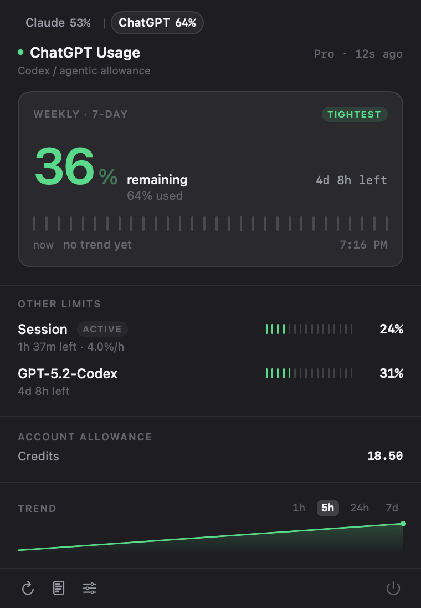
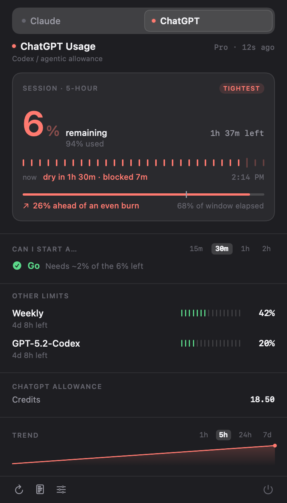
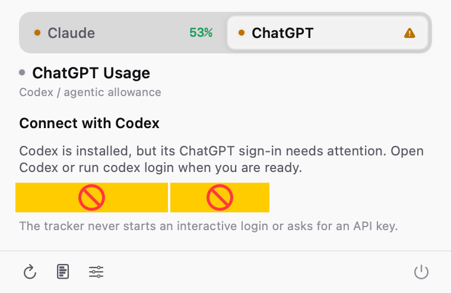
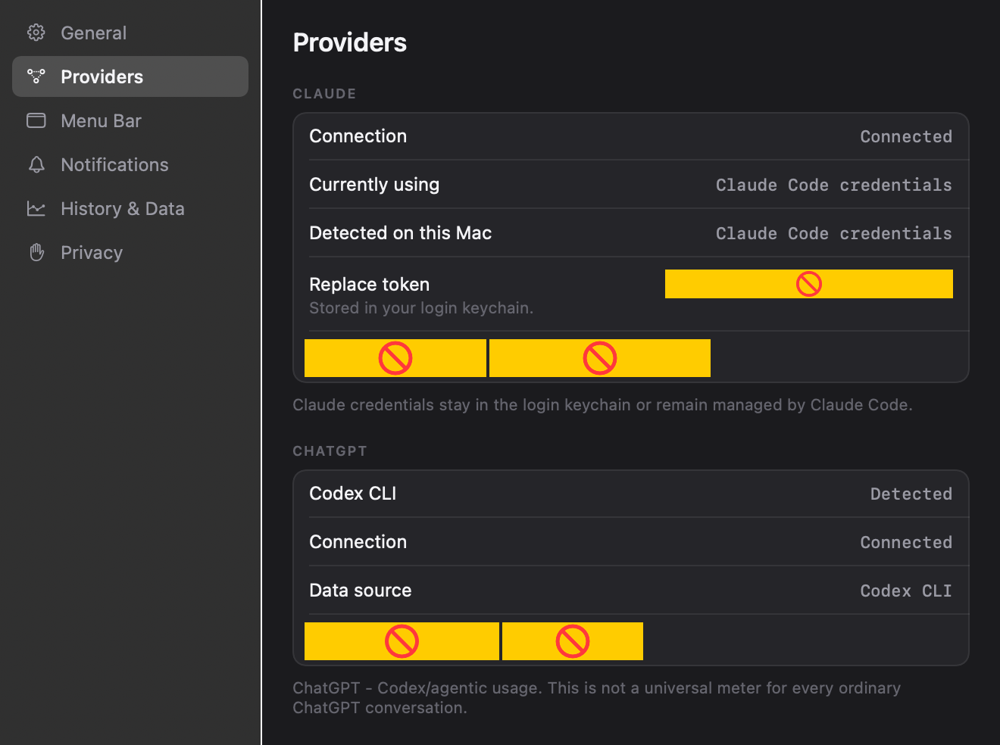
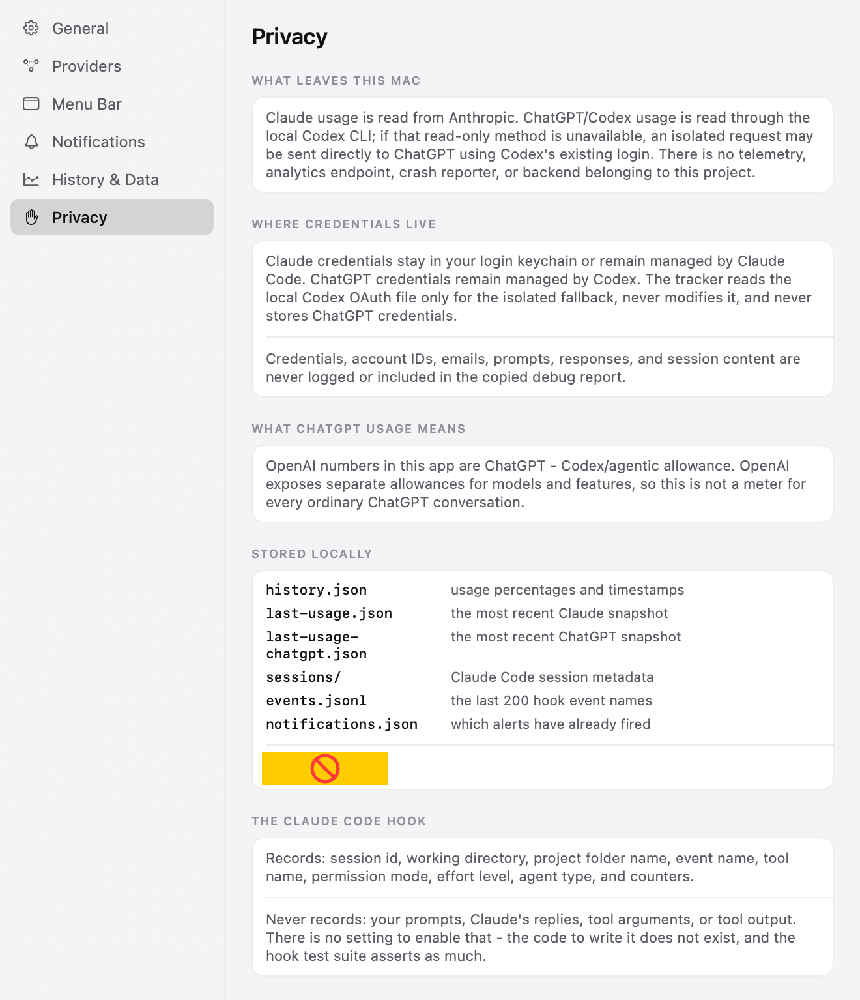

# Claude Usage Tracker v2

Know how much Claude, ChatGPT Codex/agentic, Cursor, and Grok quota you have left, how fast you are
burning it, whether you will run out before the reset - and what Claude Code is doing right
now - without leaving the menu bar.

Two clients, one data model:

| | |
|---|---|
| **Native macOS menu bar app** | SwiftUI `MenuBarExtra`, Claude plus ChatGPT Codex/agentic, Cursor, and Grok usage, notifications, local history, and Claude Code activity. The main event. |
| **Web dashboard** | React + Vite. Claude gauges, charts, and CSV export. ChatGPT, Cursor, and Grok support is native-only in this release. |

**Claude**

| Plenty left | Running out | Weekly is the constraint |
|---|---|---|
|  |  |  |

**ChatGPT** — the header switches providers, and each carries its own limits, credits and trend.
The percentage beside each name is that provider's tightest limit, so you can read both without
switching.

| Both providers | Session close to the line | Codex not connected |
|---|---|---|
|  |  |  |

Settings is a sidebar window in the same language:

| Providers | Privacy |
|---|---|
|  |  |

All 32 are generated, not hand-captured — `ClaudeUsage --render-preview <dir>` renders every
scenario and settings pane in both appearances from fixture data, so they never drift from the
real UI. (AppKit controls photograph as placeholders offscreen; they are real in the window.)

```bash
cd macos && "$(swift build --product ClaudeUsageApp --show-bin-path)/ClaudeUsageApp" \
  --render-preview ../docs/screenshots
```

### The runway

The panel is built around one question: **will I run out before the reset?**

Every tracker shows *67% used*, *resets in 1h 4m*, and *burning 44%/h* as three separate facts
and leaves you to do the arithmetic. The runway strip does it for you — the track is the time
until the reset, the fill is how far your current burn rate actually carries you, and the
hatched tail is the stretch you'll spend blocked.

```
▓▓▓▓▓▓▓▓▓▓▓╳▨▨▨▨▨▨▨▨▨▨▨▨▨▨▨▨▨   Dry in 16m · blocked 47m      4:09 PM
```

With too little history it draws a dashed, inert track and says so, rather than inventing a
line.

---

## Features

**Usage**
- 5-hour session and 7-day windows, with time-to-reset and the exact reset clock time.
- One native popover with a persistent Claude / ChatGPT / Cursor / Grok provider switcher.
  ChatGPT is labeled **Codex / agentic allowance** because it is not a universal meter for
  ordinary ChatGPT chats.
- ChatGPT windows come from the signed-in local Codex CLI, including additional model-specific
  limits and provider-supplied window durations when available.
- Cursor windows are its included-usage meter and its weekly **Grok Bot** allowance — a
  Cursor-bundled bot feature that draws on your Cursor plan, **not** on your xAI subscription.
  It is a different meter from the Grok tab and the two move independently.
- Grok is your xAI plan's pooled allowance (weekly on SuperGrok, monthly on some plans), with
  the same **Where it went** split across Automations, Chat, Imagine and the rest that
  grok.com shows, plus on-demand spend and any extra usage credits. The product percentages are
  shares of that one meter, not separate quotas, so a 97 % Automations slice never raises an
  alert of its own.
- **Model-specific limits** — read from the API's `limits[]` array, which is where Anthropic
  actually exposes them. The section is hidden entirely when your account has none.
- **Extra usage / spend** in real money, respecting the currency exponent the API sends.
- The menu bar follows the selected provider: `A` for Anthropic/Claude, `O` for OpenAI/ChatGPT,
  `C` for Cursor, `X` for xAI/Grok. Within that provider it still shows the real limit **closest to its ceiling**,
  so `5h = 25%, 7d = 91%` reads as *91%*, tagged `W`, instead of a comfortable-looking 25%.

**Analytics**
- Burn rate (%/hour), average per day, projected utilisation at reset, estimated time to 100%.
- Reset-boundary aware: a quota reset restarts the window instead of poisoning the average.
- Says **"Not enough data yet"** rather than inventing a trend from two samples.

**Claude Code activity**
- Which project is active, what it is doing, how long the turn has run, how many subagents.
- Whether it **needs you** — permission prompt, waiting for input, error, rate limit.
- Multiple concurrent sessions, each listed separately.

**Notifications**
- Threshold alerts at 50 / 75 / 90 / 95 / 100 %, configurable, once per quota window.
- Projected-overrun, sudden-acceleration, quota-reset, auth-expired, rate-limited.
- Claude Code: needs permission, waiting, long task finished, error.
- Per-category cooldowns, per-session cooldowns, and quiet hours.

**Everything else**
- Local history with 24 h / 7 d / 30 d retention and a sparkline.
- Provider-specific last-known-good values on error - never a screen of zeros.
- Credentials remain managed by Claude/Codex, with no telemetry and no backend.

---

## Installation

### Native macOS app (recommended)

**Xcode is not required.** The app builds with Command Line Tools alone.

```bash
cd macos && ./scripts/build-app.sh --install --run
```

That produces `macos/build/ClaudeUsage.app`, copies it to `/Applications`, ad-hoc signs it,
and launches it. Drop `--install` to build in place, drop `--run` to not launch.

Requirements: macOS 14+, Swift 6 toolchain (`xcode-select --install` is enough).

If you do have Xcode, `open macos/Package.swift` works too.

### Claude Code activity tracking

```bash
cd macos && ./scripts/install-hooks.sh
```

This registers observability hooks in `~/.claude/settings.json` (use `--project` to scope them
to one repo, `--dry-run` to preview). It backs the file up first and leaves every hook that
isn't ours untouched. Re-running is safe.

**Activity appears from your next Claude Code session onward** — sessions already running have
no hooks loaded.

To remove: `./scripts/uninstall-hooks.sh` (add `--purge` to delete the local state too).

### Web dashboard

```bash
npm install && npm run dev
```

Then open http://localhost:5173. Deployed builds work through the `vercel.json` rewrite.

---

## Authentication

### Claude

The native app looks for a token in this order:

1. **Its own keychain item** - anything you paste into Settings › Providers.
2. **Claude Code's credentials** - `Claude Code-credentials` in your login keychain. If you are
   signed in to Claude Code, the app just works. macOS asks your permission the first time it
   reads the item; that prompt is the consent point.
3. **`~/.claude-usage-token`** - the plaintext file v1 used. Still read, for compatibility.

### ChatGPT - Codex/agentic usage

The native app locates the installed `codex` executable, starts only its noninteractive,
read-only app-server, and calls `account/read` plus `account/rateLimits/read`. It never opens
the Codex TUI, submits a prompt, or starts an interactive login.

If an installed Codex version cannot provide rate limits, the app can read the existing local
Codex OAuth file without modifying it and make an ephemeral fallback request to
`https://chatgpt.com/backend-api/wham/usage`. Codex remains the credential owner. The tracker
does not store ChatGPT credentials and does not use an OpenAI API key. ChatGPT subscriptions
and OpenAI API billing are separate products.

### Cursor

Cursor has no read-only CLI and no API token to read from — its dashboard authenticates purely
with the browser's session cookie. Settings › Providers › **Connect Cursor** opens a one-time
embedded `WKWebView` sign-in at `cursor.com/dashboard`; once you're signed in, the app reads
the resulting `cursor.com` cookies out of that view's own website data store and stores them in
Keychain. That stored cookie is then sent as a `Cookie:` header on an isolated, ephemeral
`URLSession` for the three read-only dashboard calls — never through a shared cookie jar, and
never by reading Safari's, Chrome's, or any other browser's cookies. A rejected or expired
cookie is reported as "Cursor session expired"; remove it any time from Settings › Providers ›
**Remove stored session**.

### Grok

Grok reports consumer usage only to a signed-in session, so it works exactly like Cursor:
Settings › Providers › **Connect Grok** opens a one-time embedded `WKWebView` sign-in at
`grok.com`, and the resulting `grok.com` cookies are read from that view's own website data
store and kept in Keychain — never from Safari's, Chrome's, or any other browser's cookie jar.

The usage call itself is **gRPC-Web**, not JSON. grok.com's `GrokBuildBilling` service does
declare a `GET /rest/grok/credits` route in its proto, but that route is not mounted on the
public edge (it answers `{"code":5,"message":"Not Found"}`), so the app calls
`grok_api_v2.GrokBuildBilling/GetGrokCreditsConfig` the same way the web app does and decodes
the protobuf response itself — there is no protobuf dependency, just the handful of fields the
panel renders (`macos/ClaudeUsage/Models/GrokWireFormat.swift`). Because gRPC reports failure
in `grpc-status` rather than in the HTTP status, an expired session arrives as `HTTP 200` and
is still correctly reported as "Grok session expired". The plan label comes from
`GET /rest/subscriptions`, which *is* ordinary JSON, and its failure costs only the label.

`ClaudeUsage --debug-grok` prints the HTTP status, the gRPC status, and the decoded payload for
the stored session, and never prints the cookie.

The web dashboard needs a token pasted in (browsers cannot read your keychain). Get one with:

```bash
security find-generic-password -s "Claude Code-credentials" -w | python3 -c "import sys,json; print(json.loads(sys.stdin.read())['claudeAiOauth']['accessToken'])"
```

For local development the Vite proxy will inject `CLAUDE_CODE_OAUTH_TOKEN` server-side so the
token never reaches the browser:

```bash
CLAUDE_CODE_OAUTH_TOKEN="$(security find-generic-password -s 'Claude Code-credentials' -w | python3 -c "import sys,json; print(json.loads(sys.stdin.read())['claudeAiOauth']['accessToken'])")" npm run dev
```

---

## Privacy

Everything is local. There is no server belonging to this project, no analytics endpoint, and
no crash reporter.

**Network:** Claude usage goes to `api.anthropic.com`. ChatGPT/Codex usage normally travels
through the local Codex app-server; the isolated fallback goes to `chatgpt.com`. Cursor and
Grok usage go to `cursor.com`'s and `grok.com`'s own endpoints, each authenticated with the
session cookie from a one-time embedded sign-in. There are no project analytics or backend
destinations.

**Credentials:** Claude credentials live in the login keychain or remain managed by Claude
Code. ChatGPT credentials remain managed by Codex. The tracker never modifies Codex's OAuth
file or stores ChatGPT credentials. The Cursor and Grok session cookies are each captured once
from the app's own embedded sign-in — never from another browser's cookie jar — and stored as
separate Keychain items. Credentials, account identifiers, emails, prompts, responses, and
session content are not logged or included in copied debug reports. Network fallbacks,
including every Cursor and Grok request, use an ephemeral `URLSession` with no cache or shared
cookie storage.

**Stored locally**, under `~/.claude-usage-tracker/` (mode `700`):

| File | Contents |
|---|---|
| `history.json` | provider-qualified usage percentages + timestamps |
| `last-usage.json` | the most recent Claude snapshot, so a cold launch isn't blank |
| `last-usage-chatgpt.json` | the most recent ChatGPT snapshot; no raw response or credentials |
| `last-usage-cursor.json` | the most recent Cursor snapshot; no raw response or session cookie |
| `last-usage-grok.json` | the most recent Grok snapshot; no raw response or session cookie |
| `sessions/*.json` | Claude Code session metadata, one file per session |
| `events.jsonl` | the last 200 hook **event names** and timestamps |
| `activity.json` | a rollup for anything else you want to wire up (status bars, scripts) |
| `notifications.json` | which alerts have already fired, so they don't repeat |

**The Claude Code hook records:** session id, working directory, project folder name, event
name, tool **name**, permission mode, effort level, agent type, and counters.

**It never records:** your prompts, Claude's replies, tool arguments, or tool output. There is
no setting to enable that — the code to write it does not exist. The hook test suite asserts
this (`macos/scripts/test-hook.sh`).

Delete everything with `rm -rf ~/.claude-usage-tracker` and the Claude keychain item from
Settings › Providers › Remove stored token.

---

## Architecture

```
claude-usage-tracker/
├── src/                              React dashboard
│   ├── lib/usageModel.js             ← shared normalizer (JS twin of the Swift parser)
│   ├── App.jsx  components/  utils/
├── macos/                            native menu bar app (SwiftPM)
│   ├── Package.swift
│   ├── hooks/claude-activity-hook    observability-only Claude Code hook
│   ├── scripts/
│   │   ├── build-app.sh              → ClaudeUsage.app  (no Xcode needed)
│   │   ├── install-hooks.sh  uninstall-hooks.sh
│   │   └── test-hook.sh              end-to-end hook tests
│   └── ClaudeUsage/
│       ├── Models/       provider models, usage parsers, limits, activity, JSONValue
│       ├── Services/     Anthropic API, Codex app-server/fallback, Cursor dashboard client,
│       │                 stores, activity, settings
│       ├── Analytics/    burn rate, projection, surge detection  (pure)
│       ├── Notifications/ policy (pure) + UNUserNotificationCenter delivery
│       ├── App/  Views/  Resources/    (Cursor's WKWebView login sheet lives in App/, since
│       │                 ClaudeUsageCore stays UI-free)
│       └── Tests/        126 tests + sanitized fixtures
└── docs/MENUBAR_V2_PLAN.md           design record + full API field inventory
```

**`ClaudeUsageCore`** is a plain library with no SwiftUI import — every decision that could be
wrong (parsing, analytics, notification policy, activity aggregation) lives there and is unit
tested. **`ClaudeUsageApp`** is the SwiftUI executable on top.

The web client remains Claude-only. The native history schema adds provider identity while
decoding all existing provider-less history and cached snapshots as Claude.

---

## API limitations - read this

The app reads `https://api.anthropic.com/api/oauth/usage`, the endpoint that powers Claude
Code's own `/usage` display.

> **This is an internal, undocumented Anthropic endpoint.** It is not part of the public
> Anthropic API, it carries no stability guarantee, and it can change or disappear at any
> time. This project is not affiliated with Anthropic.

Everything here is built on the assumption that it *will* change:

- The payload is decoded into a total `JSONValue` tree and then read with optional accessors.
  A removed field becomes `nil`. Nothing throws, nothing crashes.
- `limits[]` is the primary source; the older `five_hour` / `seven_day` / `seven_day_<model>`
  keys are a fallback for accounts that still return them.
- An unrecognized limit `kind` still renders, using its raw name — new limit types show up
  rather than vanishing.
- Money always respects the `exponent` / `decimal_places` the API sends. (v1 divided by
  nothing and displayed `$3303.00` where the truth was `$33.03`.)
- **`resets_at` is only stable to the second.** The same window comes back with different
  fractional seconds on every request — `…20:00:00.196578`, then `…20:00:00.275325`. The parser
  truncates it, and a quota reset is detected from utilisation actually *falling*, never from
  the timestamp moving. Trusting the timestamp produced a "Weekly quota reset — was 39%, now
  39%" notification every couple of minutes.
- Missing fields accumulate human-readable notes visible in Settings › History › Debug.

The response also contains internal codename keys — `tangelo`, `nimbus_quill`,
`iguana_necktie`, `cinder_cove`, `amber_ladder`, `omelette_promotional`. Their meaning is not
documented, so **this app never invents labels for them.** They are preserved in the debug
export and otherwise ignored.

A full field inventory, with types and example values, is in
[docs/MENUBAR_V2_PLAN.md](docs/MENUBAR_V2_PLAN.md#2-api-field-inventory).

ChatGPT/Codex rate limits are read first from the local Codex app-server. The direct
`/backend-api/wham/usage` fallback is internal and undocumented, isolated behind a replaceable
transport and defensive parser. Missing or malformed windows stay unknown rather than
becoming 0%. The tracker uses provider-supplied window durations and epoch reset timestamps,
and never persists the untouched response.

### Cursor

Cursor usage is read from three `POST https://cursor.com/api/dashboard/*` calls
(`get-plan-info`, `get-current-period-usage`, `get-sand-usage-status`), reverse-engineered from
the authenticated dashboard's own network traffic.

> **These are internal, undocumented Cursor endpoints**, exactly like the Anthropic and Codex
> endpoints above. They are not part of any public Cursor API, carry no stability guarantee,
> and can change or disappear at any time. This project is not affiliated with Cursor.

- Parsed the same defensive way as everything else: a total `JSONValue` tree, optional
  accessors, missing or renamed fields become a schema warning rather than a crash.
- `get-current-period-usage`'s `planUsage.totalPercentUsed` is the included-usage percent
  ("Cursor Models" / "Other Models"); `get-sand-usage-status`'s `usagePercent` is the weekly
  bot allowance. The tighter of the two becomes the bottleneck, the same way ChatGPT's session
  and weekly windows compete.
- **`sand` → "Grok Bot".** Cursor's own API uses the internal codename `sand` for this
  endpoint; the label shown to you is Cursor's own product-facing name, **Grok Bot** — a
  Cursor-bundled bot feature, not an xAI/Grok subscription. The tracker does not invent this
  label; it is what Cursor's dashboard itself calls it.
- `billingCycleEnd` and similar reset fields arrive as epoch-**millisecond** strings, not the
  ISO-8601 strings Claude and ChatGPT use; the parser reads both string and numeric shapes.
- **`get-credit-grants-balance` (the "$X.XX remaining" credits line) is not implemented.** It
  returned an empty object during reverse-engineering and its real shape is unknown; this is a
  known gap, not a guess dressed up as data.

### Known limitations

- **Sessions that started before you installed the hooks are invisible.** Hooks load at
  session start.
- **A `SIGKILL`ed Claude Code leaves a session file behind** until the next refresh notices
  the pid is gone. pid reuse could in principle keep a dead record alive; it has not been
  observed.
- **A session that stops reporting** for longer than the staleness window is shown as
  *Unknown*, not as *Working*. We do not guess.
- **Notifications need a signed bundle.** `build-app.sh` ad-hoc signs, which is enough. If
  signing fails, the app falls back to `osascript` notifications and says so in Settings.
- **Model-specific limits depend on your plan.** If the API returns no scoped limits, the
  section is hidden rather than faked.
- **Dollar figures per window** (`limit_dollars`, `used_dollars`) are `null` on subscription
  plans; those rows appear only if your account populates them.
- **ChatGPT means Codex/agentic allowance only.** OpenAI exposes separate allowances for
  models and features and does not provide one public universal consumer-chat usage meter.
- **Codex CLI behavior can change.** If the app-server and isolated fallback both stop matching
  known shapes, the app keeps the last-known-good ChatGPT values and reports a sanitized error.
- **The Cursor session cookie can expire like any browser session.** When it does, the app
  reports "Cursor session expired" and you reconnect from Settings › Providers — the tracker
  never re-authenticates on its own.
- **Cursor credits (`get-credit-grants-balance`) are not shown.** See "API limitations" above.

---

## Development

```bash
# Web dashboard
npm install
npm run lint
npm run build

# Swift core + app
cd macos
swift build                    # library + app
swift test                     # 126 tests, swift-testing
./scripts/build-app.sh         # → build/ClaudeUsage.app

# Claude Code hook (46 assertions, runs against a throwaway HOME)
./scripts/test-hook.sh
```

Test fixtures in `macos/ClaudeUsage/Tests/Fixtures/` are **sanitized** — no real identifiers,
no tokens. They cover the current shape, the legacy shape, an empty payload, malformed
entries, a deliberately unknown future shape, ChatGPT session/weekly windows, additional
model limits, missing windows, malformed entries, auth failures, and process cleanup, plus
Cursor's included-usage and Grok Bot windows, missing/malformed Cursor fields, and a
rejected-cookie auth failure.

---

## Troubleshooting

**Menu bar shows `—` or "Not connected"**
Settings › Providers shows which Claude credential sources were detected. If none, paste a token or
sign in to Claude Code. If macOS asked for keychain access and you clicked Deny, grant it in
Keychain Access for the `Claude Code-credentials` item.

**"Authentication expired"**
The OAuth token was rejected. Re-run `claude` to refresh Claude Code's credentials, or paste a
fresh token in Settings.

**"Codex login required" or "Codex login needs refresh"**
Open Codex or run `codex login` yourself, then refresh. The tracker never starts an
interactive login automatically. Do not paste an OpenAI API key; it does not represent your
ChatGPT subscription allowance.

**"Cursor login required" or "Cursor session expired"**
Settings › Providers › Connect Cursor opens the one-time embedded sign-in. The tracker never
reads Safari's, Chrome's, or any other browser's cookies — only the session from that sign-in.

**"Rate limited"**
The usage endpoint has its own rate limit, separate from your Claude quota. The app backs off
automatically and keeps showing the last known values. Polling more often than 30 s will hit
this; 2 minutes is the default for a reason.

**No Claude Code activity**
Run `macos/scripts/install-hooks.sh`, then start a **new** Claude Code session. Check that
files appear in `~/.claude-usage-tracker/sessions/`. Verify the hooks landed with
`python3 -c "import json;print(list(json.load(open('$HOME/.claude/settings.json'))['hooks']))"`.

**No notifications**
Settings › Notifications shows the system permission state. If it says *Denied*, enable
ClaudeUsage in System Settings › Notifications. If it says *Unavailable*, the app is running
unbundled — build it with `build-app.sh` rather than `swift run`.

**"Launch at login" is greyed out**
`SMAppService` only works for an installed bundle. Run `build-app.sh --install`.

**"Usage format not recognized"**
Anthropic changed the payload. Turn on Settings › History › Debug to see which fields went
missing, and copy the sanitized debug report (it contains no credentials).

**Dashboard shows an old number**
That is deliberate — on an error the last successful values stay on screen, labelled with
their age, instead of being replaced by zeros.

---

## Uninstall

```bash
# Menu bar app
osascript -e 'tell application "ClaudeUsage" to quit'
rm -rf /Applications/ClaudeUsage.app

# Claude Code hooks + all local state
cd macos && ./scripts/uninstall-hooks.sh --purge
rm -rf ~/.claude-usage-tracker

# Legacy plaintext token, if you used it
rm -f ~/.claude-usage-token
```

The Claude keychain item is removed from Settings › Providers › Remove stored token, and the
Cursor session cookie from Settings › Providers › Remove stored session, or with:

```bash
security delete-generic-password -s "com.krushal.claude-usage-tracker" -a "oauth-token"
security delete-generic-password -s "com.krushal.claude-usage-tracker" -a "cursor-session-cookie"
```

Web dashboard state lives in `localStorage` under `claude-auto-tracker`; the Disconnect button
clears it.

---

## License

MIT - see [LICENSE](LICENSE). Not affiliated with or endorsed by Anthropic, OpenAI, or Cursor.
